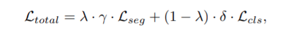

# Fabric-Defect-Detection

[](https://pypi.python.org/pypi/openl3) [](https://travis-ci.org/turian/torchopenl3) [](https://github.com/turian/torchopenl3/pulse) [](https://GitHub.com/turian/torchopenl3) [](https://github.com/turian/torchopenl3) [](https://opensource.org/licenses/Apache-2.0)

## Abstract

Automatic product inspection is a major concern in the quality control of various industrial products. The textile industry is one of the biggest traditional industries where automated inspection systems play a critical role in reducing inspection time and increasing the production rate.During the process of knitting a textile fabric frame, several types of defects may occur. For instance, the yarn used can be cut then resulting in a gap in the frame, a stain of oil can be caused by the knitting device or a color difference can be marked during the cloth drying. Thus, manual defect detection done by experts becomes quickly an overwhelming and fastidious task.
Therefore, having efficient and automatic inspection systems at hand is a major requirement for improving reliability and speeding up the quality control which may increase productivity.

## Our Idea

Our idea is based on the [this paper](https://arxiv.org/pdf/2104.06064.pdf)

We chose to use this paper as we can't find enough supervised data online. This approach not only addresses the insufficient supervised data issue but also gives result comparable to supervised approaches with less annotation cost.

## Implementation Details

Here we are using an end-to-end deep learning architecture consisting of two sub networks,i.e., segmentation network for defect detection and classification network for the confidence score. The two models are trained simultaneously in an end-to-end manner with a combined loss, that combines both the segmentation and classification loss




Where Lseg and Lcls represent segmentation and classification losses, respectively. For both, we use the cross-entropy loss. 
The remaining parameters are: 
δ  :	an additional classification loss weight,
 γ :	an indicator of the presence of pixel-level annotation 
λ  :	a balancing factor that balances the contribution of each sub-network in the final                 loss. 
Note that λ, γ and δ do not replace the learning rate η in SGD, but complement it. δ enables us to balance the contributions of both losses, which can be on different scales since the segmentation loss is averaged over all pixels, most of which are non-anomalous. 

## Architecture


## Installation
[](https://pypi.python.org/pypi/openl3)  

```python
git clone https://github.com/luckygyana/Fabric-Defect-Detection.git
cd Fabric_Defect_Detection
stramlit run infopine.py
```
